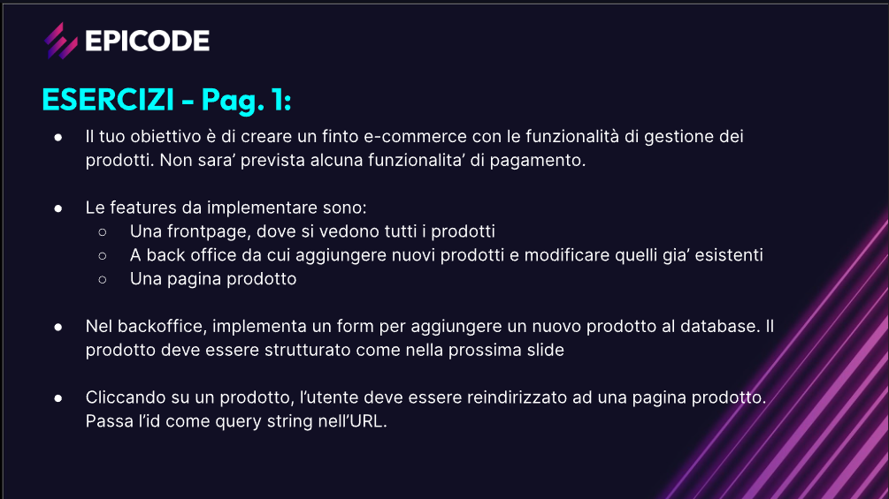
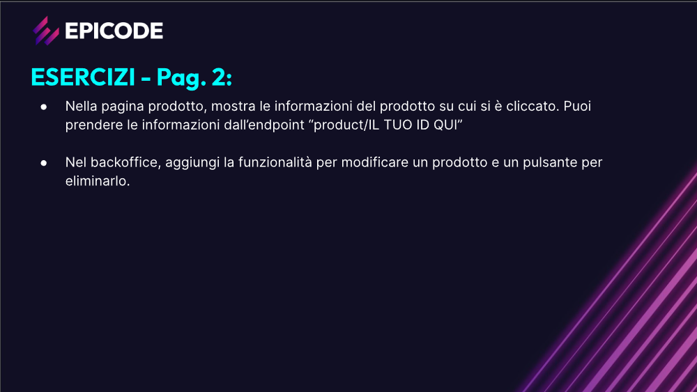
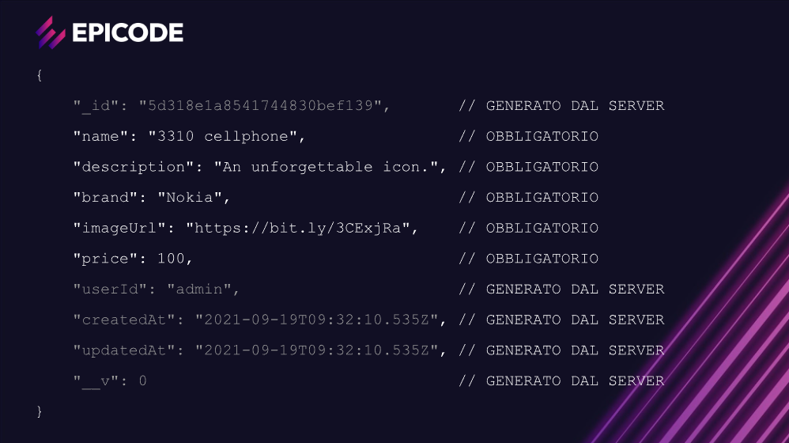
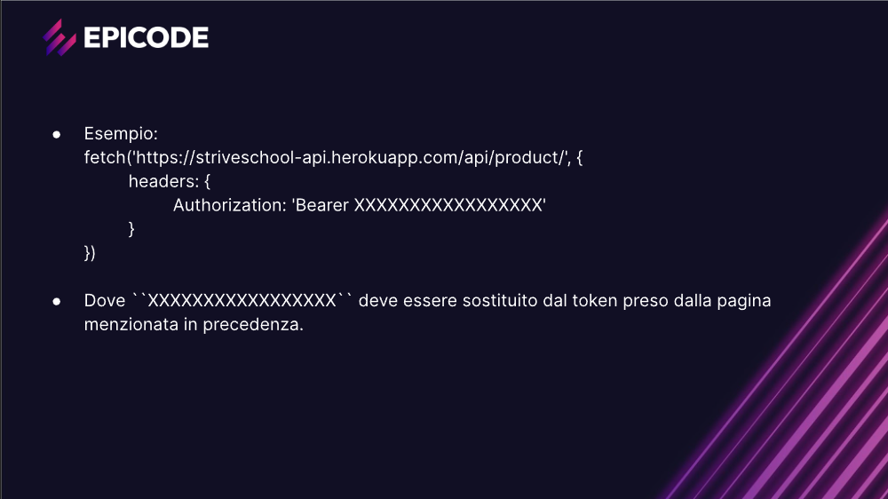

# Progetto: Marketplace

Questo progetto è un'applicazione web che permette di inserire in un database prodotti a nostra scelta.

## Funzionalità implementate ##

* Creazione di nuovi prodotti
* Modifiche dei prodotti già esistenti
* Eliminazione dei prodotti
* Visualizzazione dei prodotti della frontpage

## Tecnologie utilizzate

* HTML, CSS, BootStrap e JavaScript
* API REST 

## Consegna esercizio 

